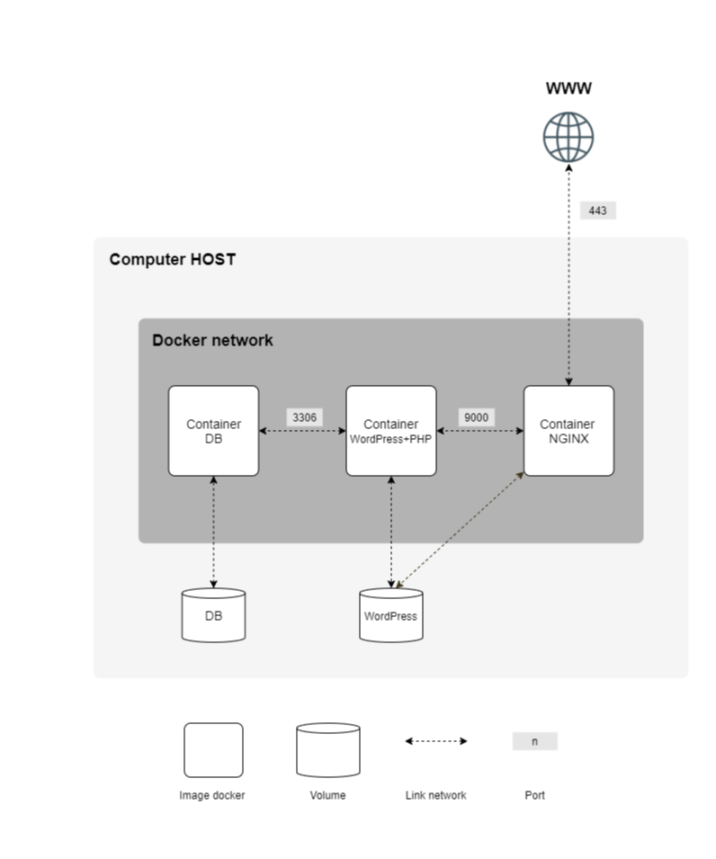

# Inception

## Project Overview

This project sets up a small web server infrastructure using Docker and Docker Compose. It includes Nginx, WordPress, and MariaDB, each running in a dedicated container. The goal is to learn about containerization, service orchestration, and custom Docker image building.

## App's structure overview



## Service Purposes

*   **Nginx (`srcs/requirements/nginx`):**
    *   Acts as a web server and reverse proxy.
    *   Handles HTTPS (TLSv1.2/TLSv1.3) requests and forwards PHP requests to WordPress.

*   **WordPress (`srcs/requirements/wordpress`):**
    *   Runs the WordPress application with php-fpm.
    *   Connects to MariaDB for database storage.
    *   Website files are stored in a persistent volume (`wordpress_data`).

*   **MariaDB (`srcs/requirements/mariadb`):**
    *   Provides the SQL database service for WordPress.
    *   Database is stored in a persistent volume (`mariadb_data`).

## Setup Steps

1.  **Prerequisites:**
    *   Docker
    *   Docker Compose
    *   `make` utility
    *   A virtual machine environment is recommended.

2.  **Environment Configuration (`srcs/.env`):**
    Create a `.env` file in the `srcs` directory with your desired credentials and domain name:
    ```env
    DOMAIN_NAME=yourdomain.localhost

    MYSQL_DATABASE=wordpress_db
    MYSQL_USER=wp_user
    MYSQL_PASSWORD=wp_password
    MYSQL_ROOT_PASSWORD=root_password
    ```

3.  **Hosts File (Optional for custom `DOMAIN_NAME`):**
    If using a custom domain (e.g., `yourlogin.42.fr`) and accessing from your host machine, add it to your system's hosts file, pointing to your VM's IP (or `127.0.0.1` if accessing from within the VM).
    *   macOS/Linux: `/etc/hosts`
    *   Windows: `C:\Windows\System32\drivers\etc\hosts`
    Example line: `127.0.0.1 yourdomain.localhost`

## How to Launch

1.  Navigate to the project root directory (`/path/to/your/inception`).
2.  Build and start all services:
    ```bash
    make
    ```
3.  Access WordPress in your browser: `https://yourdomain.localhost` (or your configured `DOMAIN_NAME`).

**Other Makefile Commands:**
*   `make down`: Stops and removes containers.
*   `make clean`: Stops/removes containers and built images.
*   `make fclean`: Performs `clean` and also removes data volumes (WordPress site and database will be lost).
*   `make re`: Rebuilds and restarts everything (equivalent to `fclean` then `all`).
